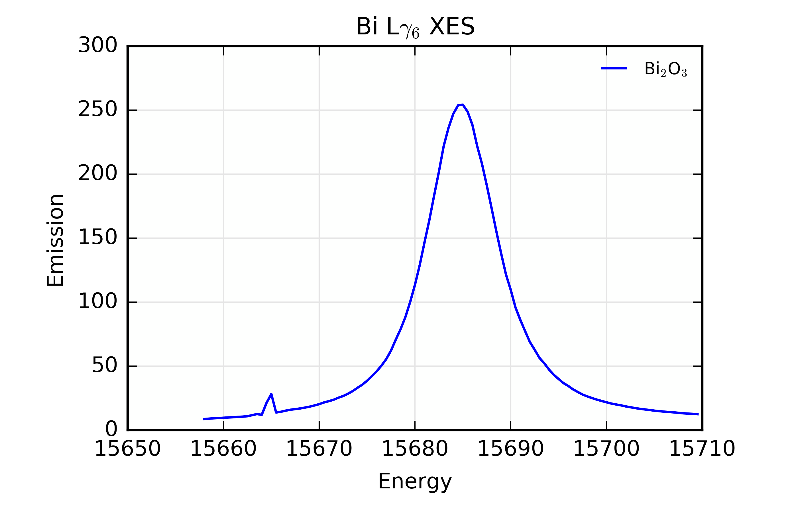

..
   The Xray::BLA and Metis document is copyright 2016 Bruce Ravel and
   released under The Creative Commons Attribution-ShareAlike License
   http://creativecommons.org/licenses/by-sa/3.0/

The Larch data model
====================

Almost any analysis project using Larch begins with data.  Typically,
these data are stored in a file of some sort and that file is stored
either on the disk of a local computer or on a server somewhere on a
local network or in the internet.  In any case, we must somehow import
that data into Larch and understand how Larch stores and interacts
with the data.

As an example, we will use an X-ray emission spectroscopy (XES)
measurement of the Bi  L\ |gamma|\ :sub:`6` emission line measured on
Bi\ :sub:`2`\ O\ :sub:`3`.

Here are the first few lines of the data file:

.. literalinclude:: ../_static/Bi2O3_Lg6.xes
   :lines: 1-34
   :linenos:

This listing has been truncated at 34 lines, including the first six
lines of the data table.  There are, in fact, 103 data points measured
from 15658 eV to 15709.5 eV on an even grid with a 0.5 eV grid
spacing.

The first 29 lines are header information containing metadata about
the measurement.  Larch is able to recognize and store this metadata.
For now, however, we will ignore the header and simply focus on the
data table |nd| the columns of numbers that constitute the results of
the measurement at each of the 103 energy points.

The most salient columns in the data table are the first and second,
containing the energy grid and average of 6 measurements of the XES
spectrum.  These are the columns labeled ``energy`` and ``xes``.  The
columns labeled ``1`` through ``6`` are the results of the individual
measurements.  The column labeled ``npixels`` tells us something about
the state of the detector at each energy point and is not especially
relevant to the current discussion.

Here is what the ``energy`` and ``xes`` columns look like when
plotted.

.. _fig-bilg6:

   The Bi L\ |gamma|\ :sub:`6` X-ray emission line, plotted from the
   full data set, the first few lines of which are shown above.

Importing column data
---------------------

The starting point for this (or any!) data analysis in Larch is
importing the data from the file on disk into Larch.  For column data,
like that shown above, this is done with Larch's `read_ascii
<http://xraypy.github.io/xraylarch/data/index.html#_io.read_ascii>`_
function.  In this case, these XES data are stored in a file called
:file:`Bi2O3_Lg6.xes` and stored in a folder called :file:`Data`.

.. code-block:: bash

   larch> bi2o3 = read_ascii('Data/Bi2O3_Lg6.xes')
   larch> print bi2o3
   <Group ascii_file _static/Bi2O3_Lg6.xes>

The `read_ascii
<http://xraypy.github.io/xraylarch/data/index.html#_io.read_ascii>`_
line opens and reads the contents of the data file, storing the result
in a way that is accessed by the symbol :quoted:`bi2o3`.  That is
:quoted:`bi2o3` is some kind of parameter that contains the contents
of the file :file:`Data/Bi2O3_Lg6.xes`.

Asking Larch to ``print`` the :quoted:`bi2o3` parameter responds with a
cryptic bit identifying the parameter as being soemthing called a
:quoted:`Group`.  To better understand what a Group is, we can use
Larch's `show
<http://xraypy.github.io/xraylarch/tutorial/builtins.html#show>`_
command.

.. code-block:: bash

   larch> show bi2o3
   == Group ascii_file _static/Bi2O3_Lg6.xes: 0 methods, 15 attributes ==
      _1: array<shape=(104,), type=dtype('float64')>
      _2: array<shape=(104,), type=dtype('float64')>
      _3: array<shape=(104,), type=dtype('float64')>
      _4: array<shape=(104,), type=dtype('float64')>
      _5: array<shape=(104,), type=dtype('float64')>
      _6: array<shape=(104,), type=dtype('float64')>
      array_labels: ['energy', 'xes', ... '_5', '_6']
      attrs: <Group header attributes from _static/Bi2O3_Lg6.xes>
      column_labels: ['energy', 'xes', ... '_5', '_6']
      data: array<shape=(9, 104), type=dtype('float64')>
      energy: array<shape=(104,), type=dtype('float64')>
      filename: '_static/Bi2O3_Lg6.xes'
      header: ['# XDI/1.0 PILATUS/100K BLA/4', '# Beamline.collimation: none', ... ]
      npixels: array<shape=(104,), type=dtype('float64')>
      xes: array<shape=(104,), type=dtype('float64')>

This tells us that :quoted:`bi2o3` is a collection of things.  Groups
are Larch's fundamental way of organizing data and metadata.
Virtually everything of interest in Larch is a Group or a member of a
Group.  These Groups are grab bags of indeterminate size.  That is,
they can contain any number of items and each item can be almost
anything, including other Groups.

In this case, the `read_ascii
<http://xraypy.github.io/xraylarch/data/index.html#_io.read_ascii>`_
function returned a group containing 15 items, all of which were
gleaned from the :file:`Data/Bi2O3_Lg6.xes` file.

#. ``filename`` is a string identifying the files that was imported.

#. Each column of the data table was loaded into an array and each
   array was given a name based on the column label at line 29 of the
   input file.  Thus the ``energy`` column is in an array called
   ``energy`` and so on.

#. The ``data`` item is two-dimensional array containing the entire
   data table in column order.  This two-dimensional array contains
   all the same data as the 9 individual arrays.

#. The column labels themselves are in a list called
   ``column_labels``.  The names of the arrays corresponding to each
   column in the data table are in a list called ``array_labels``.
   These two lists will often be the same.

#. The ``header`` list contains each line of the header from the data
   file as an element of a list.  That is, each of lines 1 through 29
   in the data file is an element of the ``headers`` list.

#. ``attrs`` is itself a Group.  This Group contains a bunch of named
   strings representing an attempt to parse meaning from the lines of
   the headers.  This will discussed in more length in Chapter ??.

Examining the data Group
------------------------

To examine individual elements of the :quoted:`bi2o3` Group, use the
``print`` and ``show`` commands and the :quoted:`dot` syntax:

.. code-block:: bash

   larch> print bi2o3.column_labels
   ['energy', 'xes', 'npixels', '_1', '_2', '_3', '_4', '_5', '_6']
   larch> show bi2o3.column_labels
   ['energy', 'xes', 'npixels', '_1', '_2', '_3', '_4', '_5', '_6']

In these examples we want to examine the ``column_labels`` items in
the :quoted:`bi2o3` Group.  This item is identified by
``bi2o3.column_labels``.

For the simple lists of strings, ``print`` and ``show`` do the same
thing.  For the arrays, the two commands are slightly different:

.. code-block:: bash

   larch> print bi2o3.energy
   [ 15658.   15658.5  15659.   15659.5  15660.   15660.5  15661.   15661.5
     15662.   15662.5  15663.   15663.5  15664.   15664.5  15665.   15665.5
     15666.   15666.5  15667.   15667.5  15668.   15668.5  15669.   15669.5
     15670.   15670.5  15671.   15671.5  15672.   15672.5  15673.   15673.5
     15674.   15674.5  15675.   15675.5  15676.   15676.5  15677.   15677.5
     15678.   15678.5  15679.   15679.5  15680.   15680.5  15681.   15681.5
     15682.   15682.5  15683.   15683.5  15684.   15684.5  15685.   15685.5
     15686.   15686.5  15687.   15687.5  15688.   15688.5  15689.   15689.5
     15690.   15690.5  15691.   15691.5  15692.   15692.5  15693.   15693.5
     15694.   15694.5  15695.   15695.5  15696.   15696.5  15697.   15697.5
     15698.   15698.5  15699.   15699.5  15700.   15700.5  15701.   15701.5
     15702.   15702.5  15703.   15703.5  15704.   15704.5  15705.   15705.5
     15706.   15706.5  15707.   15707.5  15708.   15708.5  15709.   15709.5]
   larch> show bi2o3.energy
   array([ 15658. ,  15658.5,  15659. ,  15659.5,  15660. ,  15660.5,
           15661. ,  15661.5,  15662. ,  15662.5,  15663. ,  15663.5,
	   15664. ,  15664.5,  15665. ,  15665.5,  15666. ,  15666.5,
	   15667. ,  15667.5,  15668. ,  15668.5,  15669. ,  15669.5,
	   15670. ,  15670.5,  15671. ,  15671.5,  15672. ,  15672.5,
	   15673. ,  15673.5,  15674. ,  15674.5,  15675. ,  15675.5,
	   15676. ,  15676.5,  15677. ,  15677.5,  15678. ,  15678.5,
	   15679. ,  15679.5,  15680. ,  15680.5,  15681. ,  15681.5,
	   15682. ,  15682.5,  15683. ,  15683.5,  15684. ,  15684.5,
	   15685. ,  15685.5,  15686. ,  15686.5,  15687. ,  15687.5,
	   15688. ,  15688.5,  15689. ,  15689.5,  15690. ,  15690.5,
	   15691. ,  15691.5,  15692. ,  15692.5,  15693. ,  15693.5,
	   15694. ,  15694.5,  15695. ,  15695.5,  15696. ,  15696.5,
	   15697. ,  15697.5,  15698. ,  15698.5,  15699. ,  15699.5,
	   15700. ,  15700.5,  15701. ,  15701.5,  15702. ,  15702.5,
	   15703. ,  15703.5,  15704. ,  15704.5,  15705. ,  15705.5,
	   15706. ,  15706.5,  15707. ,  15707.5,  15708. ,  15708.5,
	   15709. ,  15709.5])

The ``print`` command finds a way to represent the thing being printed
as a concise string.  The ``show`` command does basically the same
thing, but it also identifies the data type.  In the case of the
``energy`` array, the data type is `an array borrowed from Numerical
Python
<https://docs.scipy.org/doc/numpy/reference/generated/numpy.array.html>`_.

This is a critical feature of Larch.  Larch provides seamless access
to the entire `Numerical Python (aka numpy)
<https://docs.scipy.org/doc/numpy/index.html>`_ library.  That is,
anything that can be done numpy can also be done with Larch.
Similarly, Larch provides access to `Scientific Python (aka scipy)
<http://scipy.org/scipylib/index.html>`_, `the Matplotlib plotting
library <http://matplotlib.org/>`_, and a bunch of other cool Python
libraries.

Modifying the data Group
------------------------

A Group is an open bag of things.  The `read_ascii
<http://xraypy.github.io/xraylarch/data/index.html#_io.read_ascii>`_
function read the data file and organized its content into a Group.
Things can be added to or deleted from the Group.

Examining the figure above, the peak position is at about 15685 eV.
This is information that can be stored in the Group:

.. code-block:: bash

   larch> bi2o3.peakpos = 15685
   larch> show bi2o3
   == Group ascii_file _static/Bi2O3_Lg6.xes: 0 methods, 16 attributes ==
     _1: array<shape=(104,), type=dtype('float64')>
     _2: array<shape=(104,), type=dtype('float64')>
     _3: array<shape=(104,), type=dtype('float64')>
     _4: array<shape=(104,), type=dtype('float64')>
     _5: array<shape=(104,), type=dtype('float64')>
     _6: array<shape=(104,), type=dtype('float64')>
     array_labels: ['energy', 'xes', ... '_5', '_6']
     attrs: <Group header attributes from _static/Bi2O3_Lg6.xes>
     column_labels: ['energy', 'xes', ... '_5', '_6']
     data: array<shape=(9, 104), type=dtype('float64')>
     energy: array<shape=(104,), type=dtype('float64')>
     filename: '_static/Bi2O3_Lg6.xes'
     header: ['# XDI/1.0 PILATUS/100K BLA/4', '# Beamline.collimation: none', ...]
     npixels: array<shape=(104,), type=dtype('float64')>
     peakpos: 15685
     xes: array<shape=(104,), type=dtype('float64')>

Suppose that you were interested in plotting emission intensity as a
function of wavelength of the emitted photon.  The relationship
between energy and wavelength is |lambda|\ =2\ |pi|\ |hbar|\ c / E.
In units of eV\ |cdot|\ |AA|\ ngstroms, |hbar|\ c = 1973.27053324.

.. code-block:: bash

   larch> hbarc = 1973.27053324
   larch> bi2o3.wavelength = 2*pi*hbarc/a.energy
   larch> show bi2o3
   == Group ascii_file _static/Bi2O3_Lg6.xes: 0 methods, 16 attributes ==
     _1: array<shape=(104,), type=dtype('float64')>
     _2: array<shape=(104,), type=dtype('float64')>
     _3: array<shape=(104,), type=dtype('float64')>
     _4: array<shape=(104,), type=dtype('float64')>
     _5: array<shape=(104,), type=dtype('float64')>
     _6: array<shape=(104,), type=dtype('float64')>
     array_labels: ['energy', 'xes', ... '_5', '_6']
     attrs: <Group header attributes from _static/Bi2O3_Lg6.xes>
     column_labels: ['energy', 'xes', ... '_5', '_6']
     data: array<shape=(9, 104), type=dtype('float64')>
     energy: array<shape=(104,), type=dtype('float64')>
     filename: '_static/Bi2O3_Lg6.xes'
     header: ['# XDI/1.0 PILATUS/100K BLA/4', '# Beamline.collimation: none', ... ]
     npixels: array<shape=(104,), type=dtype('float64')>
     peakpos: 15685
     wavelength: array<shape=(104,), type=dtype('float64')>
     xes: array<shape=(104,), type=dtype('float64')>

   larch> show bi2o3.wavelength
   array([ 0.79182682,  0.79180154,  0.79177626,  0.79175098,  0.7917257 ,
           0.79170042,  0.79167514,  0.79164987,  0.7916246 ,  0.79159932,
           0.79157405,  0.79154879,  0.79152352,  0.79149826,  0.79147299,
           0.79144773,  0.79142247,  0.79139721,  0.79137196,  0.7913467 ,
           0.79132145,  0.79129619,  0.79127094,  0.7912457 ,  0.79122045,
           0.7911952 ,  0.79116996,  0.79114472,  0.79111948,  0.79109424,
           0.791069  ,  0.79104376,  0.79101853,  0.7909933 ,  0.79096807,
           0.79094284,  0.79091761,  0.79089238,  0.79086716,  0.79084193,
           0.79081671,  0.79079149,  0.79076627,  0.79074106,  0.79071584,
           0.79069063,  0.79066542,  0.79064021,  0.790615  ,  0.79058979,
           0.79056459,  0.79053938,  0.79051418,  0.79048898,  0.79046378,
           0.79043858,  0.79041339,  0.7903882 ,  0.790363  ,  0.79033781,
           0.79031262,  0.79028743,  0.79026225,  0.79023706,  0.79021188,
           0.7901867 ,  0.79016152,  0.79013634,  0.79011117,  0.79008599,
           0.79006082,  0.79003565,  0.79001048,  0.78998531,  0.78996014,
           0.78993498,  0.78990981,  0.78988465,  0.78985949,  0.78983433,
           0.78980917,  0.78978402,  0.78975886,  0.78973371,  0.78970856,
           0.78968341,  0.78965827,  0.78963312,  0.78960797,  0.78958283,
           0.78955769,  0.78953255,  0.78950741,  0.78948228,  0.78945714,
           0.78943201,  0.78940688,  0.78938175,  0.78935662,  0.78933149,
           0.78930637,  0.78928124,  0.78925612,  0.789231  ])

You get to put anything you want into a Group |nd| numbers, arrays,
strings, and more complicated data types that we have not yet
discussed |nd| anything.

Also note that there is no need to explicitly iterate over all the
elements in the energy array.  Instead, the equation is expressed
using the array ``bi2o3.energy``.  Because the expression for
wavelength is a function of an array-valued parameter,
``bi2o3.wavelength`` will be an array of the same length as
``bi2o3.energy``.  The evaluation of the expression for wavelength
will implicitly iterate over all the elements of the energy array.
This efficient, vectorized notation is a powerful thing that Larch
inherits from numpy.

The names of Group members
--------------------------

Although Larch's concept of a Group offers a lot of freedom, it is not
without constraints.  Most importantly, there are some hard and soft
limits on what you can name the members of a Group.  In the example
above, I specifically chose the name ``bi2o3.wavelength`` for the
array containing the wavelengths of the emitted photons.  Another
sensible name of that array is ``bi2o3.lambda`` since the Greek letter
|lambda| is used in the equation relating energy to wavelength.
Trying to set ``bi2o3.lambda`` results in a rather cryptic error
message:

.. code-block:: bash

   larch> bi2o3.lambda = 2*pi*hbarc/bi2o3.energy
   Traceback (most recent calls last): 
      File <stdin>, line 1
       bi2o3.lambda = 2*pi*hbarc/bi2o3.energy
      File <stdin>, line 1
   SyntaxError: Syntax Error

One of the weaknesses of Larch is in its error reporting.  By and
large, it inherits error reporting from Python itself or from numpy
and scipy.  This is good in that it results in error messages that are
familiar to the Python programmer.  But it is bad in that it can be
hard to understand what bit of Larch syntax triggered the error.

In this case, the problem is the use of the work ``lambda``.
``lambda`` is a `reserved word in Python
<https://docs.python.org/3/tutorial/controlflow.html#lambda-expressions>`_,
i.e. a word with a special meaning.  It is, therefore, a word that is
unavailable as the name of a Group member.

There are a number of ways around this limitation.  I chose to use a
different, but equally evocative, word.  You could also capitalize the
word |nd| ``bi2o3.Lambda`` with a capital ``L`` is just fine.

A more subtle problem with member names will arise as you dive a bit
deeper into Larch's discipline-specific areas.  For example, when you
do a background removal of an XAS |mu|\ (E) function, Larch will
insert a member called ``chi`` into the group containing your
|mu|\ (E) data.  The ``chi`` group contains the |chi|\ (k) array
extracted from the |mu|\ (E) data.  Subsequent XAS-specific functions
will expect the group to contain an array called ``chi`` containing
the |chi|\ (k) array.  If you were to make a Group member called
``chi`` containing some other kind of data, you or Larch (or both!)
might get confused down the line.

Avoiding this soft limit on the names of Group members requires some
knowledge how Larch implements its discipline-specific functionality.
Happily, Larch is pretty well documented.

Writing data to a file
----------------------

After doing some work on data, you might wish to write your results to
a new file.  This might be a file you share with a colleague, import
into Excel, or use in some other way.  Here is how that is done:

.. code-block:: bash

   larch> write_ascii("Data/lambda_xes.dat", bi2o3.wavelength, bi2o3.xes, label="wavelength xes")

This will write a column data file with two columns |nd| the
wavelength and the emission data.  The output file will not have any
header information.  See Chapter ?? for information about preserving
and creating headers.

Here are the first few lines of the newly written file with XES as a
function of |lambda|.

.. literalinclude:: ../_static/lambda_xes.dat
   :lines: 1-8
   :linenos:

Any number of columns can be written to the output file |nd| simply
add more arrays to the list of arguments to the ``write_ascii``
function.

.. todo:: Input from and output to structured files.  Other file types
          besides ASCII.
