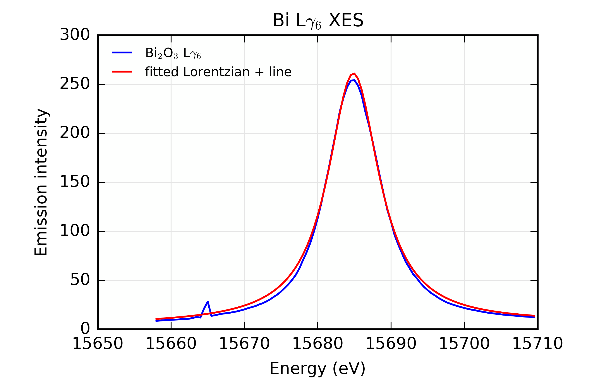

..
   The Xray::BLA and Metis document is copyright 2016 Bruce Ravel and
   released under The Creative Commons Attribution-ShareAlike License
   http://creativecommons.org/licenses/by-sa/3.0/

Fitting data with Larch
=======================

Our Bi L\ |gamma|\ :sub:`6` emission line from Bi\ :sub:`2`\ O\
:sub:`3` is basically peak-shaped.  In the last section, we compared
the emission peak to a simple Gaussian.  Here we continue in that vein
by fitting a Gaussian to our emission peak.  Throughout the course of
this section, I will walk through the evolution of a fitting model and
how that evolution is implemented in Larch.  By the end, we will have
developed an excellent description of the measured emission line.

Initial fit: Gaussian
---------------------

Here is the Larch script that implements a fit of a Gaussian to our
emission peak.

.. code-block:: python
   :linenos:

   def fit_lg6(p):
     """
     Objective function for fitting a Gaussian to a Bi Lgamma6 peak.
     """
     p.shape = p.amp * gaussian(p.energy, cen=p.centroid, sigma=p.width)
     func = p.xes - p.shape
     return func
   enddef

   ## import the data
   bi2o3 = read_ascii('_static/Bi2O3_Lg6.xes')

   ## make a group for the fitting parameters
   params          = group()
   ## the variables of the fit
   params.amp      = param(2700,   vary=True)
   params.centroid = param(15685,  vary=True)
   params.width    = param(4.5,    vary=True)
   ## arrays needed for the objective function
   params.energy   = bi2o3.energy
   params.xes      = bi2o3.xes

   ## do the fit!
   fit = minimize(fit_lg6, params) 
   fit.leastsq()

   ## put the fitted lineshapes into the bi2o3 group
   bi2o3.gaussian = params.amp * gaussian(bi2o3.energy, cen=params.centroid, sigma=params.width)

   ## plot 'em up and show the results
   newplot(bi2o3.energy, bi2o3.xes, label='Bi$_2$O$_3$ L$\gamma_6$', show_legend=True, legend_loc='ul',
           xlabel='Energy (eV)', ylabel='Emission intensity', title='Bi L$\gamma_6$ XES')
   plot(bi2o3.energy, bi2o3.gaussian, label='fitted line shape')
   show params

Let's break this down.

**Lines 1-8:**

   This is the definition of the objective function.  This is the
   central feature of Larch's fitting model.  It's something the user
   must work to understand, but it gives Larch a lot of flexibility
   for setting up different kinds of fits.

   The way I have set up this objective function is to be a function
   of a single input parameter.  This input parameter, ``p``, is
   expected to be a group the attributes of which contain both the
   variables of the fit and any arrays that are needed to evaluate the
   fit.

   The ``amp``, ``centroid``, and ``width`` parameters are used to
   make an array containing the Gaussian line shape.  Then the array
   ``func`` is defined as the difference between the XES data and the
   Gaussian.  This difference spectrum is returned by the objective
   function.

   When the fit is minimized, the variables of the fit are adjusted in
   the sense of least-squares minimization such that the sum of
   squares of the array returned by the objective function is
   minimized.

   That's how any fit works |nd| variables are varied to minimize some
   difference function.  The wonderful thing about Larch's
   implementation is that the way of specifying both the variables of
   the fit and the fitting function itself are completely up to the
   user.  In this case the fitting function is quite simple |nd| the
   difference between a Gaussian and the XES data |nd| but we will
   make it more interesting later in this section.

**Line 11:**

   Import the data in the same manner as before.

**Line 14-21:**

   Make a group to contain all the things needed for the fit at
   line 14.  At lines 16 to 18, the variables of the fit are defined.
   At lines 20 and 21, arrays needed to perform the fit are inserted
   into the newly defined parameter group.

   Remember that Larch groups can contain just about anything.  In
   this case, our parameter group contains three variable parameters
   and two arrays.

**Lines 24-25:**

   Establish a fit group and supply it with the name of the objective
   function.  Then do the actual fit.

**Line 28:**

   Compute the Gaussian using the fitting results and add it to the
   bi2o3 group.

**Lines 31-34:**

   Plot the results and show the fitted values of the variable parameters.

Here is what the fit looks like:

.. _fig-fitjustgaussian:

   Fitting just a Gaussian to the Bi  L\ |gamma|\ :sub:`6` emission line from
   Bi\ :sub:`2`\ O\ :sub:`3`.

Examining the ``params`` group shows us the fitting results as well as
various statistical quantities, including uncertainties and |chi|\
:sup:`2`.  It also allows us to examine the elements of the covariance
matrix, provides the evaluation of the difference spectrum
(i.e. ``residual``), and provides access to the gritty details of the
fit in the ``fit_details`` attribute.

Here are the results of our first fit.

.. code-block:: text

   == Group 0xaa1d904cL: 0 methods, 16 attributes ==
     amp: param(name='amp', value=2687.51333 +/- 3484038891.16153, vary=True)
     centroid: param(name='centroid', value=15685.32477 +/- 90696673.25961, vary=True)
     chi_reduced: 269.19023294591165
     chi_square: 27188.213527537078
     covar: array<shape=(3, 3), type=dtype('float64')>
     covar_vars: ['amp', 'centroid', 'width']
     energy: array<shape=(104,), type=dtype('float64')>
     errorbars: True
     fit_details: <Group 0xaa1d95ecL>
     message: 'Fit succeeded.'
     nfree: 101
     nvarys: 3
     residual: array<shape=(104,), type=dtype('float64')>
     shape: array<shape=(104,), type=dtype('float64')>
     width: param(name='width', value=4.53927 +/- 0.11045, vary=True)
     xes: array<shape=(104,), type=dtype('float64')>

In truth, this isn't a very good fit.  The centroid is too much to the
high energy side and the error bars on the parameters are enormous.

There are at least three areas in which this fitting model can be
improved:

#. Apply a restraint to the value of ``centroid``.  Instability with
   respect to this parameter is the likely cause of the large
   uncertainties.

#. The model should include a baseline to account for the rise of the
   measured data above the y=0 line.

#. Perhaps a Gaussian is not the right function.

Apply a restraint to ``centroid``
---------------------------------

It is abundantly clear from simply examining the plot of the Bi L\
|gamma|\ :sub:`6` emission line that the centroid should be a bit
below 15685 eV.  Larch provides a mechanism for restraining a variable
to sit within boundaries, evaluating the variable in such a way that
uncertainties can be properly evaluated both for the restrained
parameter and for all the other parameters of the fit.

This is done by altering line 17, as shown in the fitting script
below:

.. code-block:: python
   :linenos:

   def fit_lg6(p):
      """
      Objective function for fitting a Gaussian plus a line to a Bi Lgamma6 peak.
      """
      p.shape = p.amp * gaussian(p.energy, cen=p.centroid, sigma=p.width)
      func = p.xes - p.shape
      return func
   enddef

   ## import the data
   bi2o3 = read_ascii('_static/Bi2O3_Lg6.xes')

   ## make a group for the fitting parameters
   params          = group()
   ## the variables of the fit
   params.amp      = param(2700,     vary=True)
   params.centroid = param(15685,    vary=True, min=15684.7, max=15685.3)
   params.width    = param(4.5,      vary=True)
   ## arrays needed for the objective function
   params.energy   = bi2o3.energy
   params.xes      = bi2o3.xes

   ## do the fit!
   fit = minimize(fit_lg6, params, toler=1e-5) 
   fit.leastsq()

   ## put the fitted lineshapes into the bi2o3 group
   bi2o3.shape = params.amp * gaussian(bi2o3.energy, cen=params.centroid, sigma=params.width)

   ## plot 'em up and show the results
   newplot(bi2o3.energy, bi2o3.xes, label='Bi$_2$O$_3$ L$\gamma_6$', show_legend=True, legend_loc='ul',
           xlabel='Energy (eV)', ylabel='Emission intensity', title='Bi L$\gamma_6$ XES')
   plot(bi2o3.energy, bi2o3.shape, label='fitted Gaussian')
   show params

Here is the result of the fit:

.. _fig-restraincentroid:

   Fitting a Gaussian to the Bi  L\ |gamma|\ :sub:`6` emission line from
   Bi\ :sub:`2`\ O\ :sub:`3` with the centroid parameter restrained to
   be close to 15685 eV.

and here are the statistics of the fit.

.. code-block:: text

   == Group 0xaa35312cL: 0 methods, 16 attributes ==
     amp: param(name='amp', value=2692.42700 +/- 55.87434, vary=True)
     centroid: param(name='centroid', value=15684.89930 +/- 0.11100, vary=True, min=15684.7, max=15685.3)
     chi_reduced: 252.66484436611489
     chi_square: 25519.149280977603
     covar: array<shape=(3, 3), type=dtype('float64')>
     covar_vars: ['amp', 'centroid', 'width']
     energy: array<shape=(104,), type=dtype('float64')>
     errorbars: True
     fit_details: <Group 0xaa07470cL>
     message: 'Fit succeeded.'
     nfree: 101
     nvarys: 3
     residual: array<shape=(104,), type=dtype('float64')>
     shape: array<shape=(104,), type=dtype('float64')>
     width: param(name='width', value=4.63976 +/- 0.11153, vary=True)
     xes: array<shape=(104,), type=dtype('float64')>

Applying this restraint definitely helped.  The position of the
centroid is spot on and the uncertainties on the parameters are now
quite reasonable.

Of course, the fit still isn't very good.  Let's try adding that base
line.

Add a baseline to the fit
-------------------------

Now we add a base line |nd| just a simple line: slope * energy +
y-intercept |nd| to the fit.  This is done by adding the slope and
y-intercept parameters at lines 20 and 21.  The line is defined in the
objective function at line 6 and included in the difference function
at line 7.

At line 32,  the line is added to the bi2o3 group and it is included
in the plot of the fitted function at line 37.

.. code-block:: python
   :linenos:

   def fit_lg6(p):
      """
      Objective function for fitting a Gaussian plus a line to a Bi Lgamma6 peak.
      """
      p.shape = p.amp * gaussian(p.energy, cen=p.centroid, sigma=p.width)
      p.line  = p.slope * p.energy + p.yint
      func = p.xes - p.shape - p.line
      return func
   enddef

   ## import the data
   bi2o3 = read_ascii('_static/Bi2O3_Lg6.xes')

   ## make a group for the fitting parameters
   params          = group()
   ## the variables of the fit
   params.amp      = param(2700,     vary=True)
   params.centroid = param(15685,    vary=True, min=15684.7, max=15685.3)
   params.width    = param(4.5,      vary=True)
   params.slope    = param(-0.15,    vary=True)
   params.yint     = param(780,      vary=True)
   ## arrays needed for the objective function
   params.energy   = bi2o3.energy
   params.xes      = bi2o3.xes

   ## do the fit!
   fit = minimize(fit_lg6, params, toler=1e-5) 
   fit.leastsq()

   ## put the fitted lineshapes into the bi2o3 group
   bi2o3.shape = params.amp * gaussian(bi2o3.energy, cen=params.centroid, sigma=params.width)
   bi2o3.line  = params.slope * bi2o3.energy + params.yint

   ## plot 'em up and show the results
   newplot(bi2o3.energy, bi2o3.xes, label='Bi$_2$O$_3$ L$\gamma_6$', show_legend=True, legend_loc='ul',
           xlabel='Energy (eV)', ylabel='Emission intensity', title='Bi L$\gamma_6$ XES')
   plot(bi2o3.energy, bi2o3.shape+bi2o3.line, label='fitted Gaussian + line')
   show params

The fit is certainly better, but the shape of the periphery of the
function is a poor representation of the measured data.  Also, the
measured peak is narrower at the half-height than the Gaussian.  It
would seem that a Gaussian is not the correct function.

.. _fig-gaussianline:
.. figure:: ../_images/fit_gaussian_line.png
   :target: ../_images/fit_gaussian_line.png
   :align: center
   :width: 50%

   Fitting to the Bi L\ |gamma|\ :sub:`6` emission line from Bi\
   :sub:`2`\ O\ :sub:`3` with a line and a Gaussian with the centroid
   parameter restrained.

Despite the Gaussian not being the correct function for this
measurement,  the fit is still pretty reasonable.  The restraint on
the centroid continues to do its thing and the error bars are
reasonably small.

.. code-block:: text

   == Group 0xaa399b8cL: 0 methods, 19 attributes ==
     amp: param(name='amp', value=2202.69351 +/- 30.54872, vary=True)
     centroid: param(name='centroid', value=15684.86801 +/- 0.04953, vary=True, min=15684.7, max=15685.3)
     chi_reduced: 52.681267839202768
     chi_square: 5215.4455160810739
     covar: array<shape=(5, 5), type=dtype('float64')>
     covar_vars: ['amp', 'centroid', 'slope', 'width', 'yint']
     energy: array<shape=(104,), type=dtype('float64')>
     errorbars: True
     fit_details: <Group 0xaa064eacL>
     line: array<shape=(104,), type=dtype('float64')>
     message: 'Fit succeeded.'
     nfree: 99
     nvarys: 5
     residual: array<shape=(104,), type=dtype('float64')>
     shape: array<shape=(104,), type=dtype('float64')>
     slope: param(name='slope', value=0.09041 +/- 0.04842, vary=True)
     width: param(name='width', value=3.94482 +/- 0.05414, vary=True)
     xes: array<shape=(104,), type=dtype('float64')>
     yint: param(name='yint', value=-1392.61871 +/- 759.30955, vary=True)

Fit with a Lorentzian
---------------------

A Lorentzian is a narrower peak profile than a Gaussian and has much
longer tails.  We can give that a try simply by changing ``gaussian``
to ``lorentzian`` in the fit script at lines 5 and 31.  Since the 
`functional form of the Lorentzian in Larch
<http://xraypy.github.io/xraylarch/fitting/lineshapes.html#lorentzian>`_
is so similar to the Gaussian, making this change does not even
require altering the parameters of the fit.

.. code-block:: python
   :linenos:

   def fit_lg6(p):
      """
      Objective function for fitting a Lorentzian plus a line to a Bi Lgamma6 peak.
      """
      p.shape = p.amp * lorentzian(p.energy, cen=p.centroid, sigma=p.width)
      p.line  = p.slope * p.energy + p.yint
      func = p.xes - p.shape - p.line
      return func
   enddef

   ## import the data
   bi2o3 = read_ascii('_static/Bi2O3_Lg6.xes')

   ## make a group for the fitting parameters
   params          = group()
   ## the variables of the fit
   params.amp      = param(2700,     vary=True)
   params.centroid = param(15685,    vary=True, min=15684.7, max=15685.3)
   params.width    = param(4.5,      vary=True)
   params.slope    = param(-0.15,    vary=True)
   params.yint     = param(780,      vary=True)
   ## arrays needed for the objective function
   params.energy   = bi2o3.energy
   params.xes      = bi2o3.xes

   ## do the fit!
   fit = minimize(fit_lg6, params, toler=1e-5) 
   fit.leastsq()

   ## put the fitted lineshapes into the bi2o3 group
   bi2o3.shape = params.amp * lorentzian(bi2o3.energy, cen=params.centroid, sigma=params.width)
   bi2o3.line  = params.slope * bi2o3.energy + params.yint

   ## plot 'em up and show the results
   newplot(bi2o3.energy, bi2o3.xes, label='Bi$_2$O$_3$ L$\gamma_6$', show_legend=True, legend_loc='ul',
           xlabel='Energy (eV)', ylabel='Emission intensity', title='Bi L$\gamma_6$ XES')
   plot(bi2o3.energy, bi2o3.shape+bi2o3.line, label='fitted Lorentzian + line')
   show params

This certainly works better, although the profile of the Lorentzian is
still not a perfect match to our measured function.

.. _fig-lorentzianline:

   Fitting to the Bi L\ |gamma|\ :sub:`6` emission line from Bi\
   :sub:`2`\ O\ :sub:`3` with a line and a Lorentzian with the centroid
   parameter restrained.

The uncertainties on the parameters are mostly smaller for this better
fit.  Also there is a substantial improvement to the evaluation of
reduced |chi|\ :sup:`2`, indicating a significant improvement in the
fitting model.

.. code-block:: text

   == Group 0xaa34a0ecL: 0 methods, 19 attributes ==
     amp: param(name='amp', value=3427.50483 +/- 25.61189, vary=True)
     centroid: param(name='centroid', value=15684.86337 +/- 0.01868, vary=True, min=15684.7, max=15685.3)
     chi_reduced: 7.9706451812795605
     chi_square: 789.09387294667647
     covar: array<shape=(5, 5), type=dtype('float64')>
     covar_vars: ['amp', 'centroid', 'slope', 'width', 'yint']
     energy: array<shape=(104,), type=dtype('float64')>
     errorbars: True
     fit_details: <Group 0xaa0b7facL>
     line: array<shape=(104,), type=dtype('float64')>
     message: 'Fit succeeded.'
     nfree: 99
     nvarys: 5
     residual: array<shape=(104,), type=dtype('float64')>
     shape: array<shape=(104,), type=dtype('float64')>
     slope: param(name='slope', value=0.04180 +/- 0.01901, vary=True)
     width: param(name='width', value=4.26449 +/- 0.03476, vary=True)
     xes: array<shape=(104,), type=dtype('float64')>
     yint: param(name='yint', value=-650.18377 +/- 298.17187, vary=True)

Fit with a pseudo-Voigt
-----------------------

The fits with the Lorentzian and Gaussian function have misfit in
somewhat complementary ways.  For instance, the fit at the peak is a
bit low with the Gaussian, but a bit high with the Lorentzian.

A pseudo-Voigt function is a weighted sum of a Gaussian and a
Lorentzian with all other parameters the same.

To fit using the pseudo-Voigt profile, we change ``lorentzian`` to
``pvoigt`` at lines 5 and 32.  The pseudo-Voigt function takes an
additional parameter which represents the mixing fraction between the
Gaussian and Lorentzian parts.  This is set at line 20 and used in the
``pvoigt`` function at lines 5 and 32.  Otherwise, the script is the
same as the previous 2 attempts.

.. code-block:: python
   :linenos:

   def fit_lg6(p):
      """
      Objective function for fitting a line shape to a Bi Lgamma6 peak.
      """
      p.shape = p.amp * pvoigt(p.energy, cen=p.centroid, sigma=p.width, frac=p.frac)
      p.line  = p.slope * p.energy + p.yint
      func = p.xes - p.shape - p.line
      return func
   enddef

   ## import the data
   bi2o3 = read_ascii('_static/Bi2O3_Lg6.xes')

   ## make a group for the fitting parameters
   params          = group()
   ## the variables of the fit
   params.amp      = param(2700,     vary=True)
   params.centroid = param(15685,    vary=True, min=15684.7, max=15685.3)
   params.width    = param(4.5,      vary=True)
   params.frac     = param(0.5,      vary=True)
   params.slope    = param(-0.15,    vary=True)
   params.yint     = param(780,      vary=True)
   ## arrays needed for the objective function
   params.energy   = bi2o3.energy
   params.xes      = bi2o3.xes

   ## do the fit!
   fit = minimize(fit_lg6, params, toler=1e-5) 
   fit.leastsq()

   ## put the fitted lineshapes into the bi2o3 group
   bi2o3.shape = params.amp * pvoigt(bi2o3.energy, cen=params.centroid, sigma=params.width, frac=params.frac)
   bi2o3.line  = params.slope * bi2o3.energy + params.yint

   ## plot 'em up and show the results
   newplot(bi2o3.energy, bi2o3.xes, label='Bi$_2$O$_3$ L$\gamma_6$', show_legend=True, legend_loc='ul',
           xlabel='Energy (eV)', ylabel='Emission intensity', title='Bi L$\gamma_6$ XES')
   plot(bi2o3.energy, bi2o3.shape+bi2o3.line, label='fitted line shape')
   #plot(bi2o3.energy, bi2o3.shape, label='peak')
   #plot(bi2o3.energy, bi2o3.line, label='line')
   show params

Bingo!

.. _fig-pvoigtline:

   Fitting to the Bi L\ |gamma|\ :sub:`6` emission line from Bi\
   :sub:`2`\ O\ :sub:`3` with a line and a pseudo-Voigt with the
   centroid parameter restrained.

The evaluation of the ``params.frac`` parameter tells us that our
lineshape is mostly of Lorentzian character, but has about 17%
Gaussian character mixed in.  This quite nicely cleans up the misfit
in the previous attempt.

Even though we added an additional fitting parameter in order to use
the pseudo-Voigt function, the fit sees a significant improvement in 
reduced |chi|\ :sup:`2`.

.. code-block:: text

   == Group 0xaa353aecL: 0 methods, 20 attributes ==
     amp: param(name='amp', value=3121.37987 +/- 34.50994, vary=True)
     centroid: param(name='centroid', value=15684.86351 +/- 0.01396, vary=True, min=15684.7, max=15685.3)
     chi_reduced: 4.3816562727142312
     chi_square: 429.4023147259947
     covar: array<shape=(6, 6), type=dtype('float64')>
     covar_vars: ['amp', 'centroid', ... 'width', 'yint']
     energy: array<shape=(104,), type=dtype('float64')>
     errorbars: True
     fit_details: <Group 0xaa08f96cL>
     frac: param(name='frac', value=0.83405 +/- 0.01901, vary=True)
     line: array<shape=(104,), type=dtype('float64')>
     message: 'Fit succeeded.'
     nfree: 98
     nvarys: 6
     residual: array<shape=(104,), type=dtype('float64')>
     shape: array<shape=(104,), type=dtype('float64')>
     slope: param(name='slope', value=0.05345 +/- 0.01412, vary=True)
     width: param(name='width', value=4.14973 +/- 0.02464, vary=True)
     xes: array<shape=(104,), type=dtype('float64')>
     yint: param(name='yint', value=-831.73689 +/- 221.38340, vary=True)

That's pretty much the end of the line for fitting our Bi L\ |gamma|\
:sub:`6` emission line.  Hopefully, this step-by-step tour of a use of
Larch's objective function demonstrates how simple it is to create and
adapt a fitting model to the needs of a data set.  Because you have
all the power of Larch, numpy, and scipy at your disposal, your
objective functions can be quite interesting.

There is a lot more to be said about how parameters are defined and
used.  The ``param`` function can be used to apply interesting
mathematical constraints between parameters use in the objective
function.  This will be explored in some depth in the XANES fitting
examples in the next chapter.

