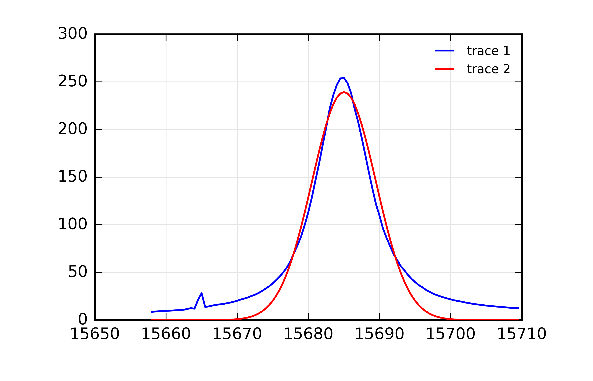
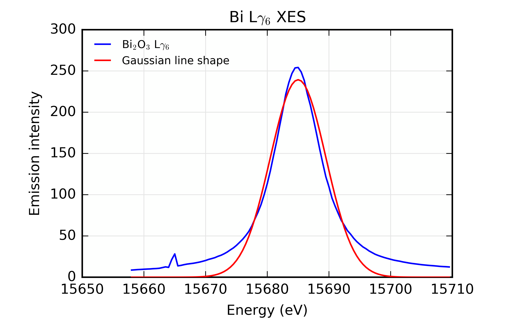
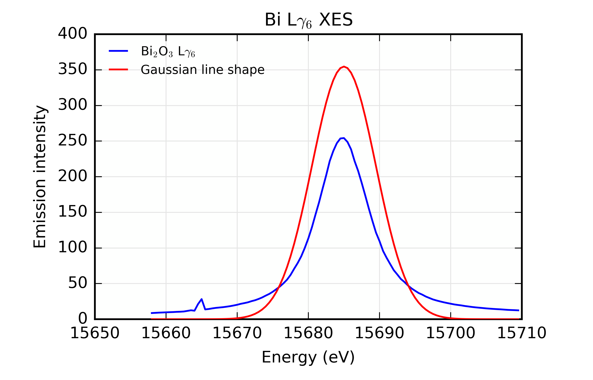
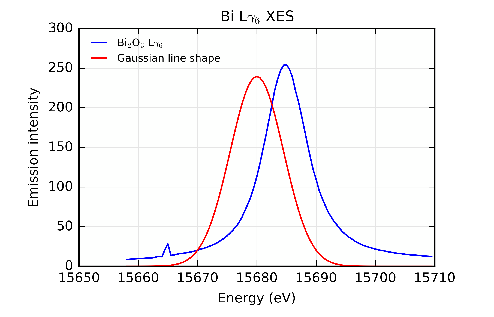
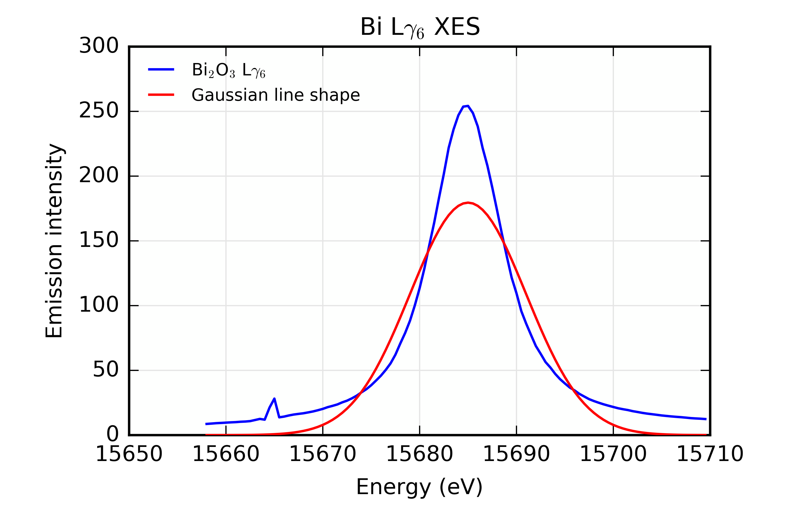

..
   The Xray::BLA and Metis document is copyright 2016 Bruce Ravel and
   released under The Creative Commons Attribution-ShareAlike License
   http://creativecommons.org/licenses/by-sa/3.0/

Manipulating and plotting data
==============================

In this section, we will cover how to do some basic work with a data
group, including elementary data manipulation and plotting.

To start, we again read the Bi  L\ |gamma|\ :sub:`6` XES data from
Bi\ :sub:`2`\ O\ :sub:`3` and recreate the plot shown in the last section.

.. code-block:: bash

   larch> bi2o3 = read_ascii('Data/Bi2O3_Lg6.xes')
   larch> newplot(bi2o3.energy, bi2o3.xes)

The second command will make the plot shown earlier, but with the
various text labels for the axes, title, and legend.  Text adornments
are discussed below.

Our XES spectrum is a fairly simple peak-shaped function.  Let's
assume that it can be well described by a Gaussian.  This is a shape
that `is already available
<http://xraypy.github.io/xraylarch/fitting/lineshapes.html#gaussian>`_
in Larch.

.. code-block:: bash

   larch> bi2o3.gaussian = 2700 * gaussian(bi2o3.energy, cen=15685, sigma=4.5)
   larch> newplot(bi2o3.energy, bi2o3.xes)
   larch> plot(bi2o3.energy, bi2o3.gaussian)

Here we have added a new array to the :quoted:`bi2o3` Group and called
it ``bi2o3.gaussian``.  The parameters if the Gaussian |nd| amplitude
of 2700, centroid of 15685 eV, and width of 4.5 eV |nd| have been set
to values that make a peak shape that resembles the measured data.  We
then initiate a new plot displaying the data, then add the Gaussian to
the plot.  Here's what they look like together:

   The Bi L\ |gamma|\ :sub:`6` X-ray emission line, plotted along with
   an initial stab at describing it using a Gaussian lineshape.

That's a dandy plot, but it is not very professional.  It is bad form
to present data without things like axis labels and a legend that
clearly identifies the traces.

**Axis labels**

  Here is how axis labels are added to a plot

  .. code-block:: bash

     larch> newplot(bi2o3.energy, bi2o3.xes, xlabel='Emission energy (eV)', ylabel='Emission intensity')
     larch> plot(bi2o3.energy, bi2o3.gaussian)

  .. figure:: ../_images/axis_labels.png
     :target: ../_images/axis_labels.png
     :align: center
     :width: 50%

     Demonstrating axis labels.

**Legend**

  Here is how you identify the traces in the plot legend

  .. code-block:: bash

     larch> newplot(bi2o3.energy, bi2o3.xes, label='Bi$_2$O$_3$ L$\gamma_6$', show_legend=True, legend_loc='ul')
     larch> plot(bi2o3.energy, bi2o3.gaussian, label='Gaussian line shape')

  .. figure:: ../_images/legend.png
     :target: ../_images/legend.png
     :align: center
     :width: 50%

     Demonstrating axis labels.
 
  Note that fancy, math-y text is specified using LaTeX syntax
  enclosed in single quotes.  The legend is displayed by setting the
  ``show_legend`` argument to ``True``.  The capitalization of the
  word ``True`` is important.  The legend is placed in the upper-left
  corner by specifying the ``legend_loc`` (location) as ``ur`` which
  means :quoted:`upper right`.  The location is some combination of
  ``u``, ``c``, or ``l`` (upper, center, lower) and ``r``, ``c``,
  ``l`` (right, center, left).  I chose ``ul`` rather than ``ur`` (the
  default) because the peak is off center to the right, leaving more
  room for the legend in the upper, left corner.

**Title**

  Here is how you supply a title for the plot

  .. code-block:: bash

     larch> newplot(bi2o3.energy, bi2o3.xes, title='Bi L$\gamma_6$ XES')
     larch> plot(bi2o3.energy, bi2o3.gaussian)

  .. figure:: ../_images/title.png
     :target: ../_images/title.png
     :align: center
     :width: 50%

     Demonstrating title text.

.. todo:: arrows and text |nd| can't say that I understand Larch's
   plot_arrow function ...

There is a `complete run down of the plotting options
<http://xraypy.github.io/xraylarch/plotting/index.html#plotopt-table>`_
in the Larch manual.

Automating plots
----------------

A good plot of our data and the Gaussian function would need all of
the adornments described above.  This gets to be `a lot` of typing.
It can be useful to have a little macro that makes the plot.  That
way, we could type up all the plotting arguments once, then run the
macro.

In Larch a macro is not different from a user-defined function and is
created using the ``def`` command:

  .. code-block:: bash

     larch> def lg6plot ():
     .....> bi2o3 = read_ascii('_static/Bi2O3_Lg6.xes')
     .....> bi2o3.gaussian = 2700 * gaussian(bi2o3.energy, cen=15685, sigma=4.5)
     .....> newplot(bi2o3.energy, bi2o3.xes, label='Bi$_2$O$_3$ L$\gamma_6$', show_legend=True, legend_loc='ul', xlabel='Energy (eV)', ylabel='Emission intensity', title='Bi L$\gamma_6$ XES')
     .....> plot(bi2o3.energy, bi2o3.gaussian, label='Gaussian line shape')
     .....> enddef

Armed with this macro, the data can be imported and the plot made
simply by 

  .. code-block:: bash

     larch> lg6plot()

resulting in this figure:

   The fully decorated plot made by the macro.

Of course, this macro is not nearly as useful as it could be.  The
parameters of the Gaussian function are hard-wired into the text of
the macro.  It would be nice to be able to explore different values of
the Gaussian parameters.

Here is an improvement on the macro using some named parameters:

  .. code-block:: bash

     larch> def lg6plot(amp=2700, centroid=15685, width=4.5):
     .....>   bi2o3 = read_ascii('_static/Bi2O3_Lg6.xes')
     .....>   bi2o3.gaussian = amp * gaussian(bi2o3.energy, cen=centroid, sigma=width)
     .....>   show bi2o3
     .....>   newplot(bi2o3.energy, bi2o3.xes, label='Bi$_2$O$_3$ L$\gamma_6$', show_legend=True, legend_loc='ul',
     .....>           xlabel='Energy (eV)', ylabel='Emission intensity', title='Bi L$\gamma_6$ XES')
     .....>   plot(bi2o3.energy, bi2o3.gaussian, label='Gaussian line shape')
     .....> enddef

Blah blah blah

.. subfigstart::

.. _fig-macroamp:

   Changing the Gaussian to have amplitude of 4000 with ``lg6plot(amp=4000)``

.. _fig-macrocentroid:

   Changing the Gaussian to have its centroid at 15680 eV with ``lg6plot(centroid=15680)``

.. _fig-macrowidth:

   Changing the Gaussian to have width of 6 eV with ``lg6plot(width=6)``

.. subfigend::
   :width: 0.3
   :label: _fig-macro_results

